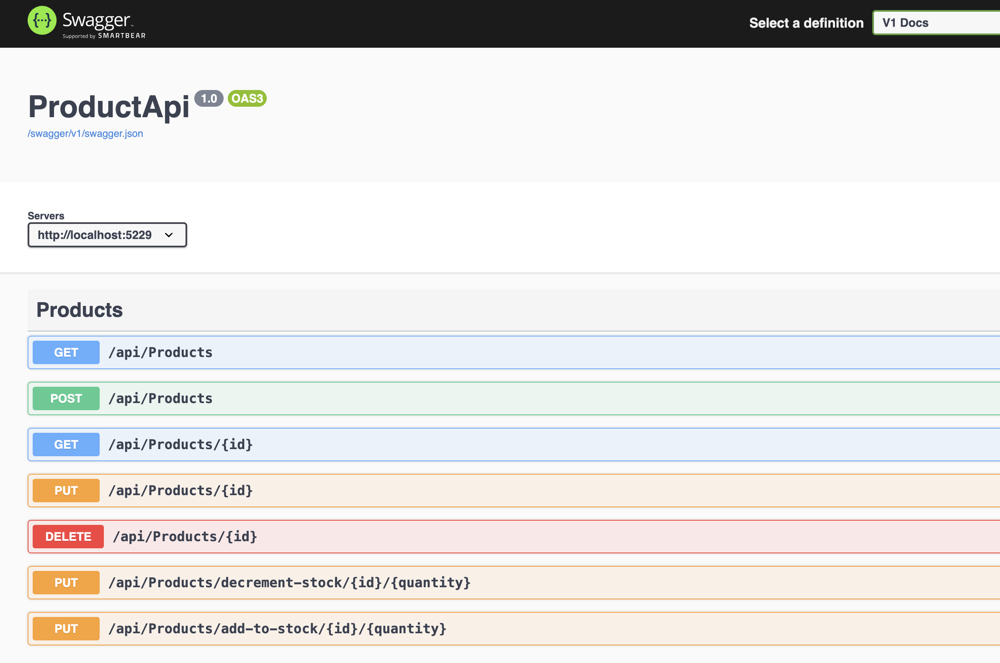

# ZEISS-Csharp-Coading-Test

- Used MySQL for the DB
- 6 Digit Id is been configured in Migration File ZEISS-Csharp-Coading-Test/ProductApi/Migrations/20250112113747_InitialCreateProduct.cs
  ```
  migrationBuilder.Sql("ALTER TABLE Products AUTO_INCREMENT = 100000;");
  ```
- Interface is used and dependency injection is used to call methods
- ProductAPI contains Controller layer, Data Layer and Service Layer
- Code First approch is used
- .NET 8 is used
- Tests are written in ProductApi.Tests
- Test cases are written in Nunit.
- In total 7 API's are there.

To run the code
Run command `<dotnet run>` it will open on port [http://localhost:5229/](http://localhost:5229/)
To Open Swagger window use url [http://localhost:5229/swagger](http://localhost:5229/swagger)

